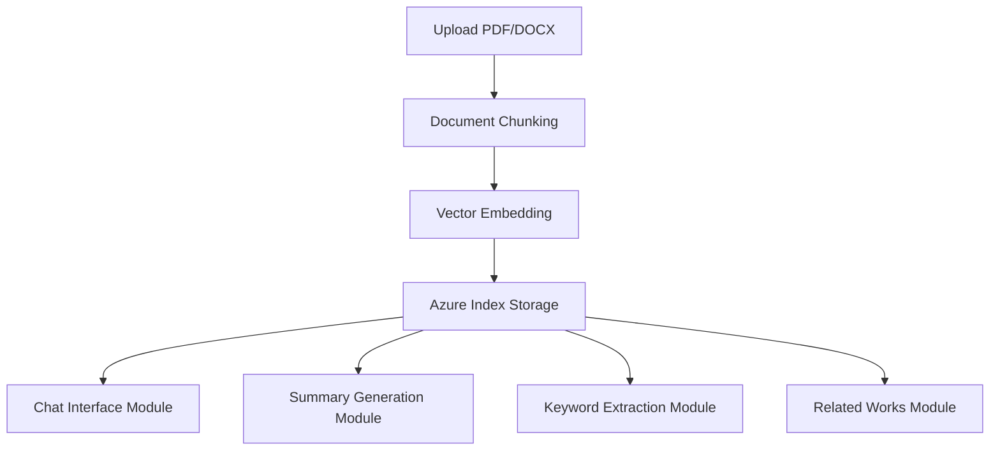

# Research Paper AI Analysis Tool

## Demo Video
[](https://youtu.be/L8u4no4AyaY)

An intelligent application leveraging Azure OpenAI and Azure AI Search to transform academic research paper interaction. Upload papers to chat with them, generate summaries, extract keywords, and discover related works.

## Folder Structure
```plaintext
main/
├── .env.example # Credentials storage
├── app.py # Main Streamlit application
├── summarise.py # Executive summary generation module
├── keywords.py # Keyword extraction and visualisation module
├── related_works.py # Related works discovery module
├── requirements.txt # Dependencies required
└── README.md # Project documentation
```

## Installation & Execution
```bash
# Clone repository
git clone https://github.com/john14759/SC4052-Cloud-Computing-Project.git

# Install dependencies
pip install -r requirements.txt

# Configure environment variables
cp .env.example .env
# Fill in your Azure service credentials in .env

# Launch application
streamlit run app.py
```

## Pipeline Architecture


## Feature Engineering
1. Document Processing Pipeline
```python

def process_and_index_document(uploaded_file):
    # File type detection
    if uploaded_file.name.lower().endswith('.pdf'):
        loader = PyPDFLoader(temp_file_path)
    elif uploaded_file.name.lower().endswith(('.docx', '.doc')):
        loader = Docx2txtLoader(temp_file_path)
    
    # Context-aware chunking
    text_splitter = RecursiveCharacterTextSplitter(
        separators=["\n\n", "\n", "(?<=\. )", " ", ""],
        chunk_size=1200,
        chunk_overlap=200
    )
    
    # Vector embedding and indexing
    embeddings = st.session_state.embeddings.embed_query(chunk.page_content)
    search_documents.append({
        "id": f"doc-chunk-{i}",
        "content": chunk.page_content,
        "content_vector": embeddings,
    })
    ...
    st.session_state.index_search.upload_documents(documents=search_documents)
```
2. Hybrid Search System
```python

def answer(query):
    # Vector + keyword hybrid search
    vector_query_content = VectorizableTextQuery(
        text=query, 
        k_nearest_neighbors=50, 
        fields="content_vector"
    )
    
    # Context enrichment
    context = st.session_state.index_search.search(
        search_text=query, 
        vector_queries=[vector_query_content], 
        top=4
    )
    
    # LLM response generation
    clone_conversation = st.session_state.conversation.copy()
    clone_conversation.append(HumanMessage(content=context_query))
    return st.session_state.llm.invoke(clone_conversation).content
```
3. Knowledge Extraction Modules

| Module             | Key Features                                                                                   |
|--------------------|-----------------------------------------------------------------------------------------------|
| **Summary Generation** | Section-wise extraction → Abstract/Intro/Conclusion synthesis → Executive summary            |
| **Keyword Analysis**   | Batch processing → Term frequency filtering → Word cloud visualization                      |
| **Related Works**      | Title/keyword extraction → arXiv/Semantic Scholar API integration → Agent-based search       |


### Analysis Features

#### 1. Structured Summary Generation
**Functionality**: Automatically extracts and summarizes key sections of research papers 

**Process**:
1. **Section-Specific Query Generation**: Creates optimised search queries for abstract, introduction, and conclusion sections
2. **Hybrid Content Retrieval**: Uses Azure AI Search with vector/text queries to find relevant chunks
3. **Hierarchical Summarisation**:
   - Section-specific agents process content using tailored prompts
   - Final executive summary combines section outputs with structured formatting

**Key Functions**:
- `generate_section_query()`: Creates section-optimised search terms to retrieve
- `extract_relevant_chunks()`: Hybrid vector/text retrieval
- `summarize_section()`: Processes section content with specialized agents
- `generate_executive_summary()`: Creates final formatted summary

---

#### 2. Keyword Analysis & Visualization
**Functionality**: Identifies and visualises key terminology across documents  

**Process**:
1. **Batch Processing**: Handles text chunks in batches for efficiency
2. **LLM-Powered Extraction**: Uses chain prompts to extract 3-5 keywords per chunk
3. **Frequency Filtering**: Excludes low-frequency/insignificant terms
4. **Visualization**: Generates keyword frequency metrics (word cloud and chart)

**Key Functions**:
- `extract_keywords_batch()`: Batch-processes chunks through LLM
- `get_all_chunks()`: Retrieves full document content
- `generate_keyword_analysis()`: Coordinates processing pipeline

---

#### 3. Related Works Discovery
**Functionality**: Finds relevant academic papers from external databases  

**Process**:
1. **Title Extraction**:
   - Hybrid search identifies candidate titles
   - LLM agent confirms primary title
2. **Keyword Optimization**: Extracts search terms from confirmed title
3. **Multi-Source Querying**:
   - arXiv: Structured literature search
   - Semantic Scholar: Academic paper discovery
4. **Progress Tracking**: Visual processing indicators

**Key Functions**:
- `generate_title_query()`: Creates title-finding search terms
- `extract_title()`: Identifies primary paper title
- `get_related_from_arxiv()`: arXiv search agent
- `get_related_from_semanticscholar()`: Semantic Scholar agent

## Prerequisites

- Python 3.1 or 3.2 (preferred)
- Azure OpenAI API provisioned service
- Azure AI Search provisioned service
- Streamlit
